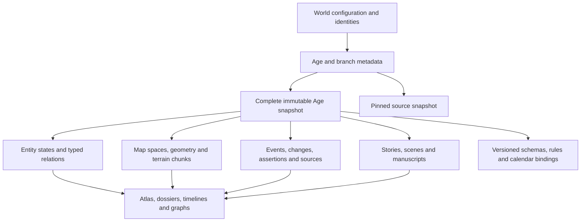

# KRIEMHILD: comprehensive platform plan

Planning baseline: 2026-10-01. This is a proposed product and implementation design, not a statement that the platform is implemented.

Read with [the assessment of all 80 reference repositories](REPOSITORY_ASSESSMENT.md), [specification coverage and decisions](SPECIFICATION_COVERAGE.md), and [the reproducible checkout inventory](research/repository-inventory.json). The source is `worldbuilding/KRIEMHILD_PLATFORM_SPECIFICATION_REVISED.md`, sections 1–65. The user's current instructions override that specification wherever they conflict.

## 1. Product decision

Build a local-first creative workspace in which the author can construct a complete world, copy it into another Age, change anything, inspect the differences, and write fiction in either historical state. Maps, people, institutions, beliefs, languages, economies, and stories are connected views of that state.

Use **Next.js and TypeScript for the entire application interface**, and **Go for world state, persistence, geography processing, history, validation, search, jobs, import/export, and Git integration**. The default installation is self-contained: one local Go service serves the compiled Next frontend and manages an ordinary project folder. No account, hosted database, paid API, external map server, or reference application is required.

The reference collection is a source of designs, algorithms, formats, and test cases. Do not combine 80 applications into a shell. No reviewed project supplies KRIEMHILD's complete Age semantics; that core must be designed and built deliberately.

### Creative authority

- No LLMs, AI writing, AI characters, AI image generation, embeddings, RAG, creative agents, automatic plot suggestions, or model-provider integrations. Remove specification §60 and the AI item in §59 from the product roadmap.
- Authors write histories, motives, myths, dialogue, and prose. The product must never invent these as background work.
- Seeded terrain generation, user-authored naming tables, phonological transformations, graph queries, mathematical calculators, and explicit simulation rules are allowed. They must be labeled accurately and expose their parameters. Naming tables are optional conveniences, not a substitute for language design.
- Derived measurements may update automatically. Substantive changes to canon require an explicit author action. A terrain preview may identify flooded cities; it must not decide their inhabitants died or start a war.
- Consistency checks operate on structured facts, links, and author-declared scene requirements. They cannot promise to understand arbitrary prose.
- There is no mandatory realism, genre, species model, political structure, family arrangement, or definition of a finished world.

## 2. What the repository study changes

| Finding | Resulting decision |
|---|---|
| Azgaar separates generators, editors, renderers, and map data, but has legacy globals and index-based identities | Borrow the separation; use stable KRIEMHILD IDs and explicit command inputs rather than adopting its entire state model |
| Filroden versions generation rules; Terra separates authored terrain layers from execution and previews | Store seed **and algorithm version and actual accepted output**; use editable operation layers, bounded previews, and terrain chunks |
| `genworldvoronoi` and `go_gens` offer relevant Go algorithms but document experimental status | Evaluate small components behind interfaces; benchmark and test them before adoption; no wholesale backend dependency |
| GLX models citations, assertions, extensible vocabularies, temporal properties, and portable genealogy in Go | Use it as a leading interoperability/model reference; do not mistake Earth-calendar support for arbitrary fictional calendars |
| Charted Roots connects people, fictional places, dates, and Markdown | Build the same kind of cross-view continuity natively, without requiring Obsidian |
| novelWriter demonstrates scene-sized documents; WorldScript demonstrates conservative project admission | Save manuscripts by scene, preserve unsupported data, and make recovery foundational |
| `story-forge`'s README describes a narrative library, but source/manifests show extensive model/chat infrastructure | Do not treat it as the advertised ready-made narrative engine |
| Lore-Flow's inspected Go entry point is a starter greeting application | Its template idea is useful; its advertised backend capabilities are not implementation evidence |
| Several projects are source-available, unlicensed, mixed-license, or primarily content | Record exact provenance; prefer new implementations of general concepts and individually cleared permissive components |
| Genealogy tools often assume two human biological parents and Earth dates | KRIEMHILD needs configurable parent roles, uncertain claims, fictional reproduction, and independent calendar logic |

The study is a static architectural review of local checkouts: README/documentation, manifests where present, file structure, licenses, and representative implementation files. It is not a build, performance, security, or exhaustive line-by-line audit. Checkout hashes make the evidence reproducible. Advertised capabilities remain identified as such where not verified in source.

## 3. The author experience

### Main shell

Always show **World → branch → Age → optional date → current selection**, alongside saved state. Use a left navigation rail, central workspace, and collapsible context panel. Let writers hide everything except the manuscript without losing context.

Primary areas: Overview, Ages, Atlas, History, People, Societies, Politics, Religion, Languages, Economy, Warfare, Nature, Rules & Technology, Lore, Stories, Research, Search, and Assets. These are views over shared entities. A settlement selected on the Atlas stays selected when opening its economy or history.

Use a contextual “Create” menu, recent items, bookmarks, keyboard command palette, saved filters, bulk editing, and customizable visible navigation. Start with names and optional notes; progressively reveal advanced fields. A user can begin with a village, a character, a conlang, or a chapter before drawing a continent.

### Three primary journeys

1. **First world:** choose a folder; name the world and first Age; choose blank, imported, or generated geography; place a settlement; create a person; link them; write a scene. Provide an optional small, original example world and a skippable tour.
2. **Next Age:** choose a source Age and revision; set label/dates; create the copy; transform map and society; record explanations when useful; review “What Changed?”; mark complete when satisfied. No checklist blocks completion.
3. **Writing:** select a historical setting; create a story; outline freely; add scenes; reference people and places; open contextual map/lore beside prose; inspect factual checks; revise and export.

### Essential interaction details

- Age switching preserves selection, map camera, and open panels where meaningful. If an entity is absent, show “not present in this Age” with historical links; do not substitute a same-named entity.
- Destruction is a lifecycle change; removal of an accidental entry is a separate editing action.
- Blank, unknown, zero, disputed, and not applicable are distinct values.
- Names, relationships, and geographic assignments support uncertainty and multiple concurrent values.
- Maps, graphs, and timelines have searchable table/list alternatives and keyboard navigation. Support IME, RTL text, Unicode/IPA, high contrast, reduced motion, adjustable type size, and non-color-only legends.
- Save states distinguish “editing,” “stored on this device,” “committed,” and “uploaded.” Git commits are not needed for ordinary saving.
- App chrome stays in the user's chosen language. A world's languages are separate from interface localization.

## 4. Age and history semantics

### 4.1 Identity, historical state, and editing history

These are three different concepts:

| Concept | Meaning | Example |
|---|---|---|
| Entity identity | Stable ID within a world, with minimal identity metadata | The city with ID `city-valer` |
| Age state | That entity's fields, relationships, names, geometry, documents, and lifecycle in a particular historical state | Valer is a port; Velar is its later ruined form |
| Revision | An author's saved edit to an Age or project | Correcting a spelling mistake today |
| Historical event/change | Something the author says happened in the fictional world | The port was destroyed in year 417 |

Use collision-resistant UUIDs for identities and authored records. A name, folder path, array index, mesh cell, or Git commit must never be an entity ID. A stable identity can have different traits and even different type facets in different Ages, allowing a historical person to be venerated as a deity later.

### 4.2 Frozen inheritance

Creating Age B from Age A pins **A's exact saved snapshot**. B initially resolves to identical historical content, including maps, relations, assets, lore, custom fields, and stories. Only Age metadata and provenance differ. B does not dynamically read A's current head.

Small objects and large assets can share immutable storage. A change creates a new object and updates only B's snapshot. B remains complete without traversing a chain of mutable ancestor Ages. Branch ancestry is provenance, not runtime inheritance.

Editing A later changes A only. Offer a separate “Review earlier-Age corrections” action that computes a three-way difference against B's pinned source revision and lets the author select updates. Never silently propagate corrections to descendants. A completed Age is read-only by default; reopening creates further revisions without destroying existing snapshots.

### 4.3 An Age spans time but has a complete overview

Resolve the specification's “state during a period” ambiguity as follows:

- Each Age has an optional historical interval and an explicit **overview checkpoint**, normally its end. The main map and dashboards show this checkpoint, clearly labeled.
- Events may occur throughout the interval. Important changes can carry validity intervals for fields, relations, names, lifecycle, or geometry, allowing a date-specific view.
- A date query uses explicit valid-time records in that Age and its pinned opening baseline. It never interpolates unwritten political, personal, or geographic history.
- An undated edit applies to the overview only. Earlier-date views show the affected fact as unresolved unless the author explicitly says it held throughout the Age.
- A child inherits its source's selected checkpoint by default. Advanced users may choose another fully resolved checkpoint. Unknowns remain unknown.
- Starting a new Age does not automatically kill characters, evolve cultures, or alter institutions. Calculated age-at-date can change; copied birth dates do not.
- Scenes can refer to an Age checkpoint or an explicit date, with warnings where the author has not defined enough temporal detail.

Implement overview snapshots first, then validity intervals before advertising date-specific continuity checks in the serious v1. Do not market event filtering as full historical-state reconstruction.

### 4.4 Branches, revisions, and stories

Ages form a directed acyclic ancestry graph; initially each Age has one source. Branch labels distinguish canon, alternate, experiment, and abandoned work. Canon is a chosen sequence, not necessarily the newest branch. Chronological overlap/gaps are allowed with explanation; alternative timelines cannot accidentally mix states.

Keep branches of fictional history separate from Git branches and story choices. A plot fork does not fork the world. A Git merge synchronizes authors' edits; it does not establish a historical merger of two kingdoms.

Each story has a stable work identity and an Age-owned version. On Age creation its content is inherited through immutable references, but the setting bindings remain pinned to their existing Age/date/revision. The author chooses “Retarget setting to this Age” to create a revised setting, previewing all affected scenes. This prevents copying an Age from silently rewriting an existing novel's setting. Multi-Age stories assign explicit contexts per scene, including flashbacks.

### 4.5 Lifecycle, splits, and merges

Rename/relocate/reform normally keep identity. A true split/merger may create new identities and lineage edges; the author decides which identity, if any, continues. Provide explicit commands with previewed relationship transfers. Preserve predecessor states. Resurrection/revival uses the same identity if the author chooses.

An entity can be historical and referenced after ceasing to exist physically. Tombstones distinguish “removed from this Age” from “destroyed in history.” Deleting an Age archives it first; snapshots referenced by children, scenes, exports, or undo remain retained.

## 5. Canonical domain model



| Record | Required role and implementation |
|---|---|
| World | ID, title, format version, project settings, identity registry, branches, reusable definition registry; no global current nation/person state |
| Age | ID, source Age/revision/checkpoint, branch, optional interval, overview date, draft/complete state, snapshot ID |
| Snapshot | Complete mapping of logical record paths to immutable object hashes; pinned schema/calendar versions; content hash |
| Entity state | Identity ID, type facets, lifecycle, names, typed properties, provenance, document and asset references; optional valid-time facts |
| Relation | Stable edge ID, typed participants/roles, properties, validity, status, evidence; n-ary relations allowed for treaties, unions and coalitions |
| Name form | Entity, language/script, spelling, transliteration, kind, validity, preferred contexts; exonyms and endonyms coexist |
| Event | Date expression, participants, place/geometry, description, causes, outcomes, associated changes and accounts |
| Change set | Explicit before/after references, operation types, date, author explanation, linked events, affected entities; groups a compound action |
| Assertion/account | Subject, predicate or narrative, claimant, truth/uncertainty status, supporting sources, validity and knowledge date |
| Geographic feature | Stable identity, map-space ID, typed geometry and relationships; rendering settings stored separately |
| Field/terrain layer | Coverage, units, resolution, authoritative chunks, generation recipe, manual overrides and derived-state dependencies |
| Population cohort | Place/region, count/range/qualitative size, species/culture/language/religion memberships, overlap semantics and date |
| Schema/template | Versioned field definitions, default layouts, relation rules, optional check rules, migrations; Age pins its versions |
| Story/scene | Age-owned work version, structure/order, setting bindings, characters, scene requirements, manuscript, comments and revisions |
| Asset/source | Content hash, media type, dimensions, author/license/attribution, captions, attachments and citations |
| Job/proposal | Input snapshot, algorithm/version/seed/parameters, progress, output artifacts, proposed changes, stale/cancelled state |

Use typed Go structs for core records plus namespaced, schema-validated custom properties. Avoid an unrestricted entity-attribute-value database for everything. JSON Schema describes portable custom field contracts; a visual form designer produces schemas without requiring users to write JSON.

Properties include text, rich text, enums, quantities with units, dates/ranges, entity references, lists, tables, and simple formula outputs. Common relations have explicit semantics and integrity rules. Domain views reuse these records rather than maintaining separate copies of cities or people. Reverse links, aggregates, search terms, map indexes, and graph layouts are derived.

## 6. Storage, portability, and recovery

### 6.1 Canonical files and rebuildable indexes

Use a documented, versioned folder format. JSON stores structured records, UTF-8 text stores prose where lossless, and binary files store large media and numeric terrain chunks. SQLite is a **local derived index/cache**, not the only copy of the world. It provides transactional indexing, full-text search, and spatial candidate lookup. [SQLite FTS5](https://www.sqlite.org/fts5.html) and [R*Tree](https://www.sqlite.org/rtree.html) document these indexing capabilities.

Proposed physical structure:

```text
my-world/
  kriemhild.json                # format marker, stable world ID
  project.head.json             # single pointer to committed project revision
  revisions/<hash>.json         # world/branch/Age heads at this saved revision
  snapshots/<hash>.json         # complete logical record manifest, sharded if large
  objects/ab/<hash>.json        # immutable readable records
  objects/ab/<hash>.md          # immutable prose/text sources when applicable
  objects/ab/<hash>.bin         # documented numeric terrain chunks
  assets/ab/<hash>.<ext>        # immutable media
  .kriemhild/                   # ignored locks, indexes, staging, local undo/session data
  exports/                     # optional, excluded from Git by default
```

Snapshot manifests map readable logical names such as `entities/<uuid>.json`, `maps/<id>/layers/elevation/<tile>.bin`, and `stories/<id>/scenes/<id>.json` to hashes. Records contain their own IDs, titles, schema versions, and interpretable values. The UI and CLI can materialize an Age into a named, human-readable tree for inspection and editing/import. Hash addressing is not encryption or a proprietary format.

This trades directly editing the canonical folder like a wiki for atomic snapshots and sharing across many Ages. Make that tradeoff explicit in the format documentation. External edits enter through an import/working-copy review; users should never need to edit hash-named immutable objects. Offer “Export editable Age folder” and “Review folder changes” without requiring Git.

A complete snapshot references its own full manifest, with shared immutable shards; it does not require replaying every past event. Copying an Age shares those shards. Editing one entity copies one object, its shard, and a small manifest. Terrain sharing works per chunk. Never store a full planet array in each JSON entity or each undo entry.

### 6.2 Durable saving

All mutations go through Go's project writer, serialized per project with optimistic revision preconditions:

1. Validate command against the expected Age/project revision; construct all changed objects in staging.
2. Write immutable objects, assets, manifest shards, snapshot and project revision; verify hashes and required references; flush them using platform-specific durability primitives.
3. Write and flush a transaction/recovery record with old and new root references.
4. Atomically replace `project.head.json` on the same volume, using a proven Windows/POSIX implementation; retain a recoverable prior root. Only now acknowledge “saved.”
5. Update SQLite indexes in a transaction tagged with the new root. On failure, the world is still saved and indexing is retried. Never display stale indexed results as current without a status indicator.

On startup, recover an interrupted root update; ignore incomplete/unreferenced staged objects; validate the root before opening for writes. A process kill at every step must leave either the old complete world or the new complete world. SQLite's own atomicity does **not** make external file writes atomic; the file protocol needs independent crash tests. See the distinction in [SQLite's atomic commit documentation](https://www.sqlite.org/atomiccommit.html).

Only one writer process may own a folder. Multiple browser tabs use the same service and revision checks. Network-share locking and concurrently edited cloud-sync folders are not supported for active writing in v1; clone locally or use one hosted service. Detect external file changes and suspend conflicting writes for review.

### 6.3 Recovery and retention

- Autosave scene edits after a short debounce, with a durable browser recovery queue until the service acknowledges. The queue is not a backup or primary database.
- Keep session undo/redo and a durable revision history. Undo is a new compensating command, never removal of another author's newer work.
- Back up the pinned root and its reachable object closure. Default rolling local backups, user-selected backup destination, and explicit restore preview. Verify restores in release tests.
- Retain objects reachable from every Age, named revision, published snapshot, active job, scene pin, undo window, and retained backup. Garbage collection is explicit/previewed, with a grace period; cross-Age references must never break.
- Version migrations are copy-and-verify operations with a rollback root. Unknown newer formats open read-only; unknown custom properties survive round trips. Never normalize away content the current version does not understand.
- A project archive includes a manifest, checksums, all required objects/assets, and format documentation. Optional caches can be omitted.

## 7. Technical architecture and deployment

### 7.1 Runtime choice

Build a modular Go monolith, not twelve microservices. Use an HTTP JSON API, generated TypeScript client, and SSE for progress/invalidation. Add WebSockets only for later collaborative editing. Start with `net/http` and explicit service interfaces; a small router is an implementation choice, not an architectural requirement.

The Next application is a static-exported client workspace served by Go. Use build-known routes such as `/workspace`, `/atlas`, and `/stories` with context encoded in query parameters, e.g. `/atlas?world=W&age=A&entity=E`. User-created IDs are not Next build-time dynamic routes. Browser-only map/editor code loads in client components; API requests go to same-origin `/api/v1`.

This avoids requiring a Node server in the default installation while keeping the entire frontend in Next. Static export cannot supply runtime Next server features or arbitrary ungenerated dynamic routes; that constraint is explicit in [Next's static export documentation](https://nextjs.org/docs/app/guides/static-exports). Prototype refresh/deep-link behavior before committing to routing. If a future hosted edition needs SSR, a Next server can serve that edition while Go remains the sole domain writer.

### 7.2 Module boundaries

```text
KRIEMHILD/
  apps/web/                    # Next interface, workers, domain workspaces
  cmd/kriemhild/                # local launcher / server
  cmd/kriemhild-cli/            # validate, inspect, export, repair-index
  internal/project/            # writer, snapshots, migrations, backups
  internal/ages/               # inheritance, comparison, branches
  internal/entities/           # schemas, relations, lifecycle
  internal/chronology/         # calendars, date resolution, valid time
  internal/geography/          # map spaces, geometry, terrain, hydrology
  internal/domains/            # society, religion, economy, language, etc.
  internal/writing/            # stories, scenes, document persistence
  internal/validation/         # deterministic checks and exceptions
  internal/index/              # SQLite projections, FTS, spatial indexes
  internal/jobs/               # bounded workers and proposal lifecycle
  internal/git/                # repository operations and semantic merge
  internal/interop/            # import/export adapters
  internal/httpapi/            # contracts, auth, transport
  schemas/                     # project, API, entity and document formats
  testdata/                    # original sample worlds and regression fixtures
  docs/                        # decisions, user guides, format specification
```

Domain packages cannot write files independently. All durable changes use the project writer. UI code cannot independently recalculate canonical history. Heavy terrain/math work runs in bounded Go jobs; browser workers handle layout, viewport preparation, and temporary stroke previews. Results carry input revision hashes so stale jobs cannot overwrite newer edits.

### 7.3 Frontend components

Use React components within Next for every workspace, accessible primitive controls, CSS design tokens, and a modest UI state store. Keep remote/query data separate from panel/camera state. Selectively load large workspaces.

Recommended candidates, subject to a pinned-version spike:

| Need | Proposed choice | Boundary |
|---|---|---|
| Rich manuscript editor | ProseMirror with a small KRIEMHILD schema and React integration; optionally Tiptap's open-source core | No paid/cloud/AI extension dependency; Go validates persisted document structure |
| Map camera/layers/geometry editing | OpenLayers inside a Next client component | Fictional planar coordinates and image maps are first-class; custom terrain rendering may use WebGL |
| Editable relationship/plot diagrams | React Flow with worker-based layout, and list/table alternatives | Graph layout is derived presentation, not canonical relations |
| Timelines/charts | D3 scales/layout primitives plus React and canvas/SVG as needed | Custom world date axis, not JavaScript Date |
| Client querying | TanStack Query or a comparably small typed query layer | Cache keys include world, Age, revision and date |
| Local indexing | SQLite FTS5, R*Tree, normalized relation tables | Rebuildable from snapshots |
| Testing | Go tests/fuzzing, frontend unit/component tests, browser end-to-end tests | File safety and historical invariants are release gates |

OpenLayers demonstrates [custom image-space projections](https://openlayers.org/en/latest/examples/static-image.html). This makes it a suitable candidate for fictional maps; it still needs performance tests for KRIEMHILD's terrain workload. ProseMirror's [schema and transaction model](https://prosemirror.net/docs/guide/) supports controlled document structures and editor transactions; persistence/round-trip behavior must be implemented and tested by KRIEMHILD.

### 7.4 Distribution

- **Local:** signed platform package with Go binary, frontend assets, bundled fonts/icons, and optional Git prerequisite detection. Browser opens to loopback. No Docker expertise required.
- **Docker:** one image initially, project directory mounted persistently, unprivileged process, explicit permissions and backup destination. Database cache can be rebuilt; project objects must remain on the volume.
- **Self-hosted/LAN:** same application with authentication enabled and TLS through deployment configuration; no access to arbitrary client filesystem paths.
- **Future hosted:** same world format and Go domain core, workspace isolation and per-project write ordering; optional object storage and shared job scheduling only when actual load warrants them.

Offline means disconnected from the internet **with the local service running**. A cached website alone cannot open arbitrary desktop folders or perform Git operations. A future PWA can cache selected content and drafts, but must not pretend browser storage is a full local project service.

## 8. Atlas, terrain, and geographic history

### Author tools

Support blank drawing, calibrated image maps, heightmap import, and seeded procedural generation. Provide continent/land-water controls, ruggedness, elevation range, islands, climate presets, optional settlement candidates, and clear seed controls. Generation yields editable geography.

Terrain tools include raise/lower, smooth/sharpen, ridge/mountain range, plateau, valley/basin, crater, island, flood/drain, coast adjustment, and masks. Water tools cover oceans, seas, lakes, river sources/mouths/confluences and editable river networks. Object tools add settlements, landmarks, boundaries, roads, trade/supply/migration routes, symbols, labels and draft annotations.

Thematic views: physical, elevation/bathymetry, slope, hydrology, climate, biome/vegetation, population, politics, culture, language, religion, resources/trade, warfare, and change. Style presets change presentation only. Label choices can follow language, exonym/endonym, historical date, or author's manual wording.

### Geographic model

- Define map spaces with explicit topology, dimensions, horizontal/vertical units and optional planetary radius. First-class planar/regional and wrapping maps in v1; spherical views later. Do not require latitude/longitude or Earth circumference.
- Store numeric terrain as tiled fields. Derive a hydrology/adjacency graph for computation; stable semantic features live separately from computational cells.
- Store authored vector geometry per feature. Generated coastlines/biomes have source hashes and an explicit generated/manual mode. Remeshing never reassigns entity identity.
- Distinguish a spatial region, political control, sovereign claim, occupation, jurisdiction and influence. They can overlap. A single “owner” column cannot represent the intended political model.
- Cultural, religious, and language distributions allow plural membership and qualitative overlays. A map color is a selected visualization, not proof of exclusive population identity.
- Regional/local maps use parent footprints and documented transforms when metrically aligned. Hand-drawn symbolic maps can link by anchor points with unknown scale. More local detail does not automatically overwrite continent-level geography.
- Floating islands, underground strata, other planes and impossible terrain use separate spaces/vertical layers and typed connections. Full 3D volumetric terrain is outside v1; its existence must not be prohibited by the schema.

### Generation pipeline

1. Create coordinate space and seed streams; select algorithm version and parameter preset.
2. Generate base heightfield/continents; optional later tectonic model.
3. Apply authored terrain layers/masks in order.
4. Classify water connectivity and derive drainage/flow, preserving authored exceptions.
5. Calculate optional temperature/moisture/wind and biome candidates.
6. Offer optional settlement/route candidates based on explicit suitability inputs.
7. Preview all changed fields/features; accept into a snapshot or discard.

Use independently seeded stages so changing labels does not alter mountains. Persist accepted output, not merely a recipe whose result may change with an upgrade. Version algorithms and numeric encoding; establish deterministic CPU reference fixtures. GPU previews may be approximate, but cannot silently become authoritative persisted geography.

Changing terrain invalidates dependent hydrology, suitability and route estimates. Show “needs recalculation,” allow locks and authored exceptions, then preview affected areas. In v1, some hydrology rebuilds may cover the whole basin/map; do not promise exact local recomputation for globally connected watersheds.

### Historical geography

Compare any two resolved snapshots side by side, overlay or change-only. Match features by identity; compare geometry separately from labels/styles. Show changed terrain chunks and feature-level changes, including rename, diversion, submersion and destruction. A crater operation can be grouped with a geological event and selected consequences as one undoable transaction.

Primary references: Fantasy-Map-Generator, Filrodens-world-map-builder, genworldvoronoi, go_gens, worldengine, Terra, hexploit, scenario-forge, Open-Map-Creator. Supporting references: WorldGeneratorFinal, planet_heightmap_generation, ancientWorldMap, FantasyMapGenerator.

## 9. Chronology, events, and historical explanation

Provide an Age ancestry board, multi-track event timeline, event editor, causal graph, historical entity tabs, and “What Changed?” dashboard. Filter by place, person, polity, culture, language, religion, family, rulebook, or story. Events can be nested into wars, campaigns, reforms, migrations and geological periods.

Dates must preserve the entered expression and precision: exact, approximate, before/after, range, unknown, or relative to another event. Use a custom world-time representation with signed integer ticks serialized as decimal strings, plus scale/precision. Avoid JS number precision loss and `time.Time`/Gregorian assumptions for fictional chronology. Geological ranges may use coarse intervals rather than day-level precision.

Calendars are versioned definitions: year-zero policy, eras, month/week structures, intercalary/leap rules, cycles, epoch and explicit conversion mappings. Simple arithmetic calendars are v1. Complex/irregular calendars retain the author's text until a deterministic conversion is defined. Unconvertible calendars remain partially ordered rather than receiving invented dates. Editing a calendar definition does not rewrite old Ages; adoption is a reviewed migration.

Maintain **valid time** (fictional date) separately from **recorded time** (editing timestamp) and, where relevant, **knowledge time** (when an in-world source knew it). Chronology checks return definite conflict, possible conflict, or insufficient information.

A factual field edit may have an optional event/explanation. Spelling corrections should not require a historical event. Batch transformation can group several domain edits under one event, with before/after values derived from actual snapshots. Consequences are authored links or explicit calculator results, never generated narratives.

References: timelines for event/span/group UX; GLX and Charted Roots for date/provenance ideas; GeneWeb/GEDKeeper for genealogy chronology edge cases. None is an off-the-shelf Age engine.

## 10. People, entities, societies, and settlements

### People and flexible entities

Provide dossiers with summary, biography, traits, abilities, affiliations, relationships, possessions, locations, family, historical states, appearances in stories, and sources. Trait scales and character study templates are author-defined; do not impose D&D classes or psychological scoring.

The entity browser supports facets, saved views, tags, aliases, duplicates review, bulk property changes and CSV import. Custom types and field layouts are first-class. A single identity can have person, ruler, historical figure, and venerated-deity facets over time. Species, artifacts, organizations, vehicles and user-defined concepts use the same reference machinery.

### Settlements and local detail

Allow camp/village/town/city/port/fortress/monastery/colony/ruin and custom forms. Track population, government, industries, supply, defenses, institutions, districts, important people and events. Nested location hierarchies reach districts, buildings, rooms or a scene location without requiring every level.

Birth, expansion, relocation, abandonment and rebuilding are historical changes. A replacement settlement can reuse a site without automatically reusing the former city's identity. Settlement dashboards aggregate linked records, with provenance and date shown.

### Cultures, populations and migration

Cultures document language, traditions, values, art, food, dress, architecture, kinship customs, education and social practices. Cultures can mix, split, borrow or revive without a one-culture-per-state restriction.

Store populations as cohorts/counts/ranges or qualitative descriptions. Separate residence, citizenship, culture, language, religion and species. Do not sum overlapping memberships as if they were disjoint groups. Migration records link origin/destination, routes, dates, causes, scale and consequences. Optional demographic calculators require explicit assumptions and output proposals.

References: Kanka and Worldbinder for connected dossiers/navigation; deorum and SCSG for optional fields; family-book for names/date precision; world-maker and Lore-Flow for template/file ideas. Reimplement restricted or unlicensed designs; omit AI features and game-specific content.

## 11. Politics, institutions, law, and social structure

Support tribes, stateless societies, chiefdoms, city-states, kingdoms, empires, republics, federations, colonies, occupations and custom forms. Model jurisdictions and control as relations to geographic areas, not a fixed hierarchy of countries.

Political entities link rulers, offices, institutions, population cohorts, capitals, resources and treaties. Diplomatic relations cover alliance, hostility, peace, war, tribute, vassalage, federation, claims, disputed boundaries, trade dependencies, migration pressure and authored espionage ties. A treaty is an entity with participants, terms and validity; its consequences are explicit relations.

Institutions carry mandates, authority, offices, membership terms, resources and internal factions. Laws have jurisdiction, effective/repeal dates, affected groups, source institutions and exceptions. Social classes/statuses define rights, obligations, mobility, taxes and cultural terminology. Competing legal systems may coexist; contradictions can be intentional facts of the setting.

Provide nation/region dashboards and political graphs. Tensions are authored assessments or explainable queries: “three overlapping claims,” “one blocked tin route,” “two eligible successors under this rule.” Do not provide opaque stability or ideology scores. Optional numeric indexes show their formula, missing inputs and user-configured weights.

References: scenario-forge's ownership/control distinction, Worldbinder's continuity structure, Kanka's related entities. Simulator and online-geopolitical-simulator are visual references only; their automated political behavior is not the product design.

## 12. Religions, pantheons, lore, and perspectives

Religion supports polytheism, monotheism, animism, non-theistic traditions, philosophies, syncretism and custom structures. No deity is required. Model doctrine, ritual, taboo, sacred calendar, clergy, texts, sites, symbols, sects and legal/political relationships.

Pantheon graphs use shared entity relationships for ancestry, marriage, rivalry, alliance, domains and interpretations. A culture's account of a deity can differ from the author's asserted reality. Divine genealogies need not satisfy biological rules; graph views must tolerate intentional cycles and paradoxes.

Track reform, schism, merger, persecution, conversion and spread across Ages. Link doctrine versions to laws and institutions explicitly. An influence map distinguishes geographic presence, majority/minority estimates, sacred sites and political sponsorship.

Lore documents include myths, legends, songs, sayings, rituals, prophecies, chronicles, sacred texts and oral traditions. Each can have versions, translations, attributed authors, known audiences and conflicting accounts. The author can leave objective truth undecided. Separate in-world belief from draft/canon status: a canonical false rumor is valid world content.

Create sourced assertions where detailed research matters, while ordinary prose remains sufficient. Story spoiler/knowledge views filter what a character or audience knows at a given time. A story bible is assembled from selected records and quotations with provenance, without an LLM summary.

References: GLX assertions/citations, Open Siddur's text variants/translations/commentary concepts, TiddlyWiki transclusion, Ars Magica as an optional content-model stress test. `open-deity-project` is an essay, not a pantheon engine.

## 13. Magic, technology, and rulebooks

Build user-defined rulebooks for magic, physics, technology, supernatural systems and other setting mechanics. A world can disable magic entirely. A fictional AI technology may be documented as world content without adding AI to the application.

Basic v1 rulebooks contain sources, access, capabilities, costs, limitations, prohibitions, learning, prerequisites, resources, artifacts, institutions, social effects and historical availability. Graphs show prerequisite and dependency relationships. Technology records distinguish discovery, local adoption, production capability, loss and rediscovery.

Advanced rules use a constrained expression language: typed quantities, boolean predicates, comparisons, bounded aggregation and explicit dependencies. No arbitrary JavaScript, Go, shell, or executable templates. Include cycle detection, evaluation budgets, units checking, error explanations and versioned formula definitions. Results never rewrite authored values unless accepted.

Provide calculator sheets, capability matrices and author-designed diagrams. Rule conflicts can be intentional exceptions tied to a person, place or event. Avoid building a universal RPG combat engine into the foundation.

References: diagrams-for-magic-systems for visual patterns; Commlink6 for modular rules/export separation; CraftSim for input/output recipes and what-if comparison; Ars Magica for expressive system examples. No required game settings or ruleset.

## 14. Languages and historical names

Basic v1: language identities, family/contact graphs, geography, dialects, script samples, grammar/phonology notes, dictionaries, multiple senses/parts of speech, multilingual entity names, etymology and borrowing links. Enable IPA/Unicode input and author-chosen collation; preserve original text and normalization policy.

Later linguistic workbench: phoneme inventories and feature groups; syllable templates; phonotactics validation; weighted word tables; ordered sound changes; morphology paradigms; affixes; transliteration; custom orthography; interlinear glosses and example sentences. Handwritten entries remain valid even when rules are incomplete.

Sound changes operate on phoneme tokens, not ambiguous character substrings. The author selects a source lexicon revision, ordered rules and target Age/language, previews changes and exceptions, then applies selected outputs. Preserve cognate IDs and derivation provenance. Conlang Studio's token-based rule implementation is particularly relevant here.

Place names reference language-specific forms and validity, so conquest, sound change, translation and administrative renaming can coexist. Changing a city's name updates contextual display labels and flags manuscript mentions; it never silently changes quoted prose.

References: conlang-studio and PolyGlot are leading algorithm/workflow references; Perplexicon for senses; Glotbase for script/affix UX; fanlang for explicit replacement, clearly labeled transliteration rather than semantic translation; pynames for optional table generators. Bakhroshungz and Nyrakai are language-documentation examples, not engines.

## 15. Economy, resources, trade, and dependencies

Model resource deposits, extraction sites, industries, recipes, goods/services, markets, currencies, guilds, taxes, tariffs, debts and monopolies. Quantities can be qualitative, ranges or precise values with units. Avoid false numeric precision.

Routes are typed geographic/network records with endpoints, modes, legs, capacity, seasonality, access, costs, reliability, political restrictions and dependencies. Allow ferries, sea lanes, caravans, rail, flight and portals. A route can be manually drawn or calculated; recalculation is a proposal.

Provide production-chain and dependency graphs, import/export dashboards, chokepoints, and a “What depends on this?” inspector. Start with graph reachability and author-defined supply requirements. For numeric mode, use explicit recipe ratios, available capacity and demand. Scarcity warns of an unmet condition, not a predicted rebellion.

Use Go pathfinding on transport graphs with documented cost functions. Preserve units, currencies and conversion dates. Fixed-point/decimal values are preferable for money. Negative-cost edge rules and disconnected routes must have defined behavior.

Later optional experiments cover inventories, transport constraints and population demand. All run against a snapshot with explicit durations and assumptions, and return charts/proposed changes. No autonomous economic agents deciding fictional history.

References: EconoSim production/finance concepts, CraftSim recipes, go_gens markets/demographics, genworldvoronoi trade-route geography. Julia/Lua are not default runtime requirements.

## 16. Families, dynasties, ancestry, and inheritance

Use a relationship graph, not a strict tree: partnerships, marriages, biological/adoptive/guardian/ritual parenthood, multiple parents, unknown parents, disputed ancestry, clones and author-defined roles. Partnerships do not require children. Identity, gender, reproductive role and social role are distinct.

Provide ancestor, descendant, hourglass, kinship path, dynasty, and time-filtered views; collapse distant branches and show repeated ancestors without duplicating identity. Handle pedigree collapse and consanguinity. Place limits on path enumeration rather than freezing on large graphs.

Dynasties have founders, membership rules, titles, heraldry, holdings, claims and lineage. Offices and title tenures are date-bounded records. Succession uses explicit ordered rules, exclusions, competing claims and evidence. Show the calculated candidate order and unresolved cases; authors choose the political outcome.

Inherited traits are optional custom rules. Support simple dominant/recessive or weighted rules only when requested, with unknown parental states and exceptions. More complex fictional inheritance can be documented narratively. This is not a real-world medical genetics product, and traits must not determine culture or morality.

GEDCOM/GLX imports map to stable identities and source records through a preview. Preserve unsupported relationships in an extension payload and report conversion loss. Earth-centric exchange formats are adapters, not KRIEMHILD's native schema.

Leading references: GLX, Charted Roots, FamilyTreeView, open-pedigree. Other genealogy projects supply specific lessons on uncertain dates, privacy, kinship, diff review and reports; see the full assessment.

## 17. Warfare, logistics, and campaigns

Basic v1 provides wars/campaigns/battles, participants, causes/objectives, armies/fleets/units, commanders, organization hierarchies, deployment locations, routes, forts, supply links, outcomes and treaties. Outcomes are authored. Link effects to political, demographic and economic changes.

Campaign map overlays show forces, fronts, movement, depots, siege approaches, supply and occupied areas. Use the same map spaces and route network as civilian transport. At each date, distinguish planned movements from recorded ones.

Logistics checks use declared consumption, capacity, travel rates, terrain and transport modes. Qualitative supply states work without full numbers. Travel estimates show uncertainty and allow magic/technology exceptions. Numerical combat resolution is not needed for the writing platform.

Later add tactical local maps, counters, measurements, time steps and replay of authored orders. Default iconography is setting-neutral; optionally support military standard symbols through `milsymbol`, with standards catalogs from `mil-std-2525`. Render in the browser, avoiding a required symbol server.

References: VASSAL for counters, map layers and reversible orders; scenario-forge for fronts/control; milsymbol for rendering. No automatic opponent AI, war generation or copied game modules.

## 18. Ecology, climate, creatures, and geological change

Track temperature, precipitation, seasonality, winds, snow/ice, ocean conditions, vegetation, habitat, biome, soil and optional agricultural suitability. Let descriptions substitute for numerical fields. Fictional biomes and authored overrides are first-class.

Species/creature dossiers link habitats, behavior notes, ecological roles, resources, domestication, populations and relationships such as predation, pollination and symbiosis. Distinguish species from an individual named creature.

Support erosion, sedimentation, glaciation, desertification, forest change, earthquakes, volcanoes, floods and impacts as authored transformations with optional bounded numerical previews. Keep geological time scales separate from annual human chronology.

A climate edit can mark habitat and production estimates stale and reveal dependent settlements. It does not automatically migrate populations or rewrite politics. Model execution records input/output hashes, algorithm version, parameters, seed, time scale and limitations.

References: worldengine, genworldvoronoi, go_gens, hexploit, planet_heightmap_generation, Terra. Deep coupled ecological simulation is later work, not a dependency of useful climate maps.

## 19. Writing as a first-class workspace

### Planning and composition

Support works/series, premise, themes, stakes, conflict, research, characters, arcs, plot threads, acts/sequences/chapters/scenes. Do not force three-act structure. Provide outline, corkboard, timeline and split views. Scene order is narrative order; event chronology is a separate field.

Each scene has setting context, POV, participants, locations, optional time/duration, goals/conflict/outcome, referenced artifacts/rules, revision status and manuscript. Story-specific character studies overlay the canonical dossier without overwriting it. Foreshadowing/payoff links and character knowledge can be authored explicitly.

The editor supports headings, emphasis, lists, scene breaks, footnotes/endnotes, images, comments, revision snapshots, find/replace, author dictionary, word counts, goals and focus mode. Conventional local dictionary spellchecking is allowed; no generative rewriting or grammar model. Goals and statistics are optional.

Use scene-sized documents, stable block IDs and schema-versioned document JSON as the rich-text canonical representation. Export readable Markdown and HTML. Do not claim Markdown preserves every comment, complex table or custom node; lossless backup uses native project objects. Comment anchors use stable block IDs plus mapped offsets; orphaned anchors become visible after edits.

Save batches of editor transactions to Go, checking document revision. Editor undo handles local typing groups; project undo handles structural/world actions. Switching Ages or scenes flushes pending work or retains a clearly marked recovery draft. Manuscript editing remains usable while background map jobs run.

### Context and continuity

Mentions carry entity IDs and the scene setting binding; visible prose remains author-controlled. A sidebar resolves characters, places, rules and historical names at that setting. Backlinks show every scene referencing an entity.

Continuity checks compare declared scene dates/participants/requirements against lifecycle, location, name validity, technology/magic availability, known facts and route travel bounds. A character using an untagged sword in unstructured prose cannot be reliably inferred; provide an optional “scene requirements” panel instead of promising semantic analysis.

World changes trigger a review queue for stories using floating/current bindings. Pinned settings remain unchanged until explicitly updated. Published manuscript editions pin document and world snapshots, fonts and export template versions.

### Export and publication

First release: lossless native archive, Markdown, HTML, image maps and browser print/PDF workflows. Serious v1: story bible and selected-Age codex, with filtered links and attribution. Later: tested EPUB/DOCX exporters, atlas books, language/religion guides, character compendia, screenplay/Fountain support and visual scene boards.

Author-selected publication profiles control spoiler fields, private notes, branches and audience knowledge. Build an allowlisted publication graph first, then render it: excluded content must not leak through search indexes, filenames, embedded metadata or backlinks. Preview the exact package before publishing. Public sites are static outputs and do not expose the editing service.

Interactive fiction is an optional later workspace using authored nodes, choices and bounded conditions. Its runtime state is separate from Age canon. `branching-tales-2-0` and `storyboard` offer useful concepts; neither should become the core manuscript engine.

## 20. Search, research, graph exploration, and assets

Search defaults to the selected Age. Explicit all-Age mode returns grouped identity histories with Age/branch badges. Index aliases, historical names, properties, relations, notes and manuscript text. Exact, prefix and conventional fuzzy matching suffice; no embedding service.

Support structured filters, bounding-box/region search, “what happened here,” “who ruled here,” and dependency traversals. Implement these as saved query templates with filter controls rather than an LLM chat box. Bound graph depth and return provenance paths.

The knowledge graph is a derived view of canonical typed relations, filtered by context. It must not become a second database. Store user layout preferences independently of relations.

Research inbox accepts notes, links, citations, files and manually written excerpts. Promote a note into an entity/event while retaining its ID or a redirect and backlinks. Record source author, title, date, page/locator, access date and usage rights. Distinguish real research sources from fictional in-world documents.

Assets are deduplicated by hash; preserve originals and derive thumbnails. Track attachment relationships, alt text, captions, credit/license, visibility and optional focal points. Uploaded images are not automatically geographic source data. Symbol/heraldry editors can assemble author-selected vector shapes; generative image tools are excluded.

## 21. Deterministic checks and author-controlled experiments

Three severities have different meanings:

| Level | Meaning | Behavior |
|---|---|---|
| Integrity error | Missing referenced object, malformed record, corrupt hash, invalid storage graph | Block the invalid write or open affected data read-only; preserve originals |
| Consistency warning | Dates overlap unexpectedly, ruler not active, route blocked, resource missing | Allow save; explain input facts and offer an exception |
| Information | Incomplete inputs, possible downstream effects, stale calculation | Allow save; show uncertainty and next useful action |

Checks return rule ID/version, affected IDs, Age/date, supporting facts and explanation. Exceptions include reason, scope and expiry/revision sensitivity. A changed rule/input can cause an exception to be reviewed again. Fantasy impossibilities are not storage errors.

Build a dependency index so changes rerun relevant checks. Numeric formulas use explicit units, bounded evaluation and deterministic ordering. Derived values carry provenance and stale state. Distinguish a structural dependency from an authored claim of historical causation.

Every experiment follows: select snapshot → configure rules/seed → run cancellable job → inspect maps/tables/differences → choose changes → revalidate against current head → apply as one change set. Partial acceptance validates dependencies; dependent results cannot be accepted against rejected inputs without recalculation. Offer an alternate Age for experimentation. Do not simulate political intentions, personalities, plot, or creative decisions.

## 22. Git integration and interoperability

### Git as optional synchronization

Local folders remain complete without Git. Repository mode can initialize a local repository, clone an existing KRIEMHILD project, review changes, commit, fetch, pull, push and restore a revision through the UI. GitHub is an optional remote provider, not the definition of a world.

Use a Go adapter invoking a detected Git executable with argument arrays and controlled configuration. Prefer the mature Git CLI over reimplementing all merge/credential behavior initially. Package setup explains missing Git without blocking local creation. Store tokens in OS credential storage or supported Git credential helpers, never project files or frontend storage.

### Semantic merging

Fetch first. Prepare reconciliation in an isolated staging worktree, preserving the active working state; [Git worktrees](https://git-scm.com/docs/git-worktree) provide the underlying separate-checkout mechanism. Do not run an ordinary pull over unsaved project data.

Resolve base/local/remote project roots into logical records. Automatically combine disjoint fields/objects only when valid. Conflicts include edit/edit, edit/delete, list ordering, schema version, same-ID creation, scene blocks, geometry and binary terrain overlap. Provide base/mine/remote previews with names and Age context. Terrain conflicts offer both copies or selection of whole affected chunks/operations initially; do not promise arbitrary pixel-perfect merging.

Write a validated merged project revision referencing the union of needed objects, then produce the Git merge commit. User-facing differences come from resolved records, not raw hash pointer lines. A merge conflict in `project.head.json` is a signal to run semantic resolution, never to choose a pointer blindly.

Canonical snapshot objects are normal Git files. Large terrain/media may use Git LFS as an optional mode after repository-size measurements. A local archive must include actual object bytes, not unresolved LFS pointers. Explain missing remote assets clearly. Exclude caches, locks, credentials, temporary jobs and local UI preferences.

### Import/export strategy

All importers have format/version detection, quotas, dry-run preview, ID remapping, source provenance, validation and a loss report. Import into a draft or new Age by default. Never silently conflate entities by matching names.

Priority order: native archive and editable folder; CSV/JSON/Markdown; raster/heightmap and documented vector geometry; selected Azgaar `.map` versions; GEDCOM and GLX; conlang CSV/JSON and selected PolyGlot formats; optional genealogy/notes/timeline formats. Only advertise versions tested with fixtures.

GeoJSON is appropriate for compatible geographic coordinates. Arbitrary fictional planar geometry uses a native map-space wrapper or a format supporting its coordinates; do not falsely label arbitrary XY values as standard WGS84 GeoJSON. Preserve scales, units, transforms, source IDs and unsupported fields where possible.

## 23. Optional services and reusable components

The default platform requires **none of the 80 repositories as a companion service**. A library embedded after review is different from a separately operated application.

| Candidate | Possible optional use | Default recommendation |
|---|---|---|
| worldengine | Locally packaged Python generation worker, returning height/climate/biome artifacts | Prefer a native Go pipeline; offer only if its output materially improves terrain tools |
| EconoSim.jl | Explicit numerical research experiment worker with bounded inputs | Defer; native production/dependency calculators satisfy core needs |
| genworldvoronoi demo server | Algorithm prototyping and reference outputs | Extract/evaluate suitable Go components; do not ship the demo server as core |
| milsymbol-server | Optional remote/headless symbol rasterization | Browser `milsymbol` is sufficient; omit server |
| Gramps Web, webtrees, GeneWeb, WTFamily | Existing external genealogy archive connected through explicit exchange | Import/export only initially; avoid a second authoritative family database |
| Open Siddur | Specialized source-text publishing workflow | Implement native text variants and publication; no eXist service requirement |
| TiddlyWiki | User-selected standalone wiki publication/exchange | Native codex and static export first |
| PolyGlot, novelWriter, Storyboarder, VASSAL, Terra | External authoring companions via files | Optional desktop interoperability, not platform services |
| AI-centric applications/providers | None | Excluded, including locally hosted models |

Any later worker is locally runnable, optional, version-pinned, input/output constrained, cancellable, and unable to write canonical files. The Go service validates returned artifacts and the author accepts changes. Network independence and data format portability remain release requirements.

## 24. Security, privacy, accessibility, and ownership

The local HTTP service binds to loopback by default and authenticates the launched browser session. Validate Origin/Host, prevent cross-site mutations and DNS rebinding, constrain filesystem access to selected roots, and check symlink/path traversal. A webpage must not be able to make the local server read arbitrary files. Hosted access uses server-enforced world permissions and secure sessions.

Sanitize HTML/SVG and imported document content; disable executable templates, embedded scripts and automatic remote fetches. Bound archive expansion, image dimensions, XML parsing, geometry complexity and formula execution. Preview external URLs before opening; reference repository installers/scripts are not product dependencies.

No telemetry or manuscript upload by default. Diagnostics are local and redact paths/content/credentials; users inspect any exported diagnostic bundle. Third-party assets/fonts are bundled for offline use with notices. Record dependency provenance and maintain a software bill of materials when implementation begins.

Keep the repository's existing Apache-2.0 license unless the owner decides otherwise. Code/data reuse decisions are per file and dependency: permissive root licenses do not automatically clear fonts, portraits, game content or transitive libraries. Restricted and uncertain repositories remain conceptual references unless separately cleared. The audit identifies those cases; it does not claim a legal compatibility review has been completed.

Accessibility is a design constraint from the first slice: keyboard-complete editing, focus recovery, screen-reader descriptions, equivalent table views, scalable text, input method support, and sufficient contrast. A final accessibility audit cannot repair a canvas-only architecture cheaply.

## 25. Performance and verification targets

These are proposed engineering budgets to validate, not claims about existing code. Establish a repeatable baseline on an 8-core laptop with 16 GB RAM and SSD, including a Windows machine; record browser and GPU. A smaller 8 GB configuration must remain functional through progressive loading.

| Workload / action | Initial target |
|---|---|
| Reference world | 20 Ages, 50,000 identities, 200,000 relations, 10,000 events, one million manuscript words, 4k × 2k terrain, 2 GB media |
| Stress suite | 100 Ages, 250,000 identities, one million relations, many local maps; no eager loading of all snapshots/media |
| Warm Age switch / dossier | p95 under 500 ms for initial useful content |
| Search | p95 under 300 ms warm; paginate results |
| Map movement | Aim for 60 fps, retain usable 30 fps on baseline integrated GPU; bound visible features and labels |
| Typing | No application-induced stalls over 50 ms in ordinary scenes |
| Autosave | Durable acknowledgement normally under 1 second after debounce for text/entity edits |
| Age creation | Small metadata operation, target under 2 seconds independent of total unchanged media bytes |
| Heavy generation/import | Progress visible promptly, cancellable, memory capped; benchmark throughput before setting completion promises |
| Restart/recovery | Root validity checked before writes; opening an already-indexed project should not scan every media byte |

Use lazy snapshot shards, viewport tiling, level of detail, simplified display geometry, worker layout, debounced queries, cursor pagination and bounded caches. Save authoritative full geometry; simplification belongs to render caches. Monitor file count and Git overhead as well as RAM/FPS.

### Required verification

1. **Age isolation:** change every content category in B; A and siblings remain unchanged; editing A later cannot alter B. Include schema/calendar changes, assets and manuscripts.
2. **Completeness:** child snapshot resolves without live parent lookup; parent archival does not break it; reference closure survives export/import.
3. **Temporal correctness:** uncertain dates, year zero, BCE-like eras, leap/intercalary rules, unconvertible calendars, overlapping Ages, undated edits and multi-Age scenes.
4. **Storage safety:** kill process at each save/migration step; disk full, permissions errors, corrupted objects, stale locks, interrupted asset writes and Windows replacement behavior.
5. **Merge correctness:** disjoint edits, conflicting fields, geometry, scene ordering, schema migrations, same-ID collisions, edit/delete and no data lost on cancellation.
6. **Map correctness:** deterministic fixtures, bounded numeric values, topology/scale, wrapping seams, river connectivity, locked authored exceptions and stale-result rejection.
7. **Family correctness:** pedigree collapse, adopted/multiple/unknown parents, disputed ancestry, cyclical divine relationships and large-path limits.
8. **Writing safety:** IME/RTL, pasted content, undo groups, autosave/recovery, moved/deleted scene anchors, scene reorder and export round trips.
9. **Privacy:** publication allowlist excludes secrets from every artifact and index; local hostile-origin and traversal tests; permission tests in hosted mode.
10. **Offline and no-AI:** first launch after installation, map/edit/search/write/export with network disabled; dependency/egress review verifies no provider calls or model downloads.

## 26. Delivery sequence and acceptance gates

Do not label a thin map/wiki prototype as the first serious version. Specification §59 requires a connected baseline across the domains and a usable writing environment. Development milestones make that large scope manageable.

| Phase | Deliverable | Dependencies and exit gate |
|---|---|---|
| P0 — decisions and risk spikes | File-format ADR, Age/time semantics, Next static shell, map benchmark, rich-text round-trip, Git merge prototype, import license shortlist | Demonstrate crash-safe root replacement on Windows; refresh a deep link to an arbitrary new world; compare two map snapshots; settle document format before full UI work |
| P1 — creative vertical slice | Create/open world, first Age, custom entities/relations, image map with pins, scene editor, save/recovery/undo, search, copy Age, rename city, comparison | Write in Age A; derive B; rename/move a city and edit a scene; restart and prove A is byte-for-byte unchanged and links resolve correctly |
| P2 — atlas and temporal backbone | Seeded editable terrain, water/rivers, settlements/borders/routes, layers, event timeline, calendars, validity intervals, alternate branches, change explanations | Flood a region in B, review affected sites, record event, compare maps and inspect a scene before/after the event without invented history |
| P3 — societies and integrated writing | Basic politics, cultures, religions/pantheons, languages/names, institutions/law/classes, families, rulebooks, economy, warfare, climate/ecology; plot/arc/scene tools | Demonstrate one settlement connecting every relevant domain and manuscript; all links preserve Age/date; basic numerical and qualitative inputs both work |
| P4 — serious v1 release | GitHub/local repository UI and semantic conflicts; backups/migrations/import preview; consistency workspace; native/Markdown/HTML/maps export; codex/story bible; Docker and packaged local distribution | All §59 essential features covered; recovery/merge/offline/performance/accessibility gates pass on a multi-Age reference world |
| P5 — deep authoring | Advanced conlang tools, succession/inherited traits, production/trade experiments, advanced terrain/ecology, tactical map tools, local-map detail, EPUB/DOCX/Fountain and storyboards | Each feature is optional, uses existing context/storage/command contracts, and cannot mutate canon without acceptance |
| P6 — sharing and collaboration | Static interactive publication, hosted workspaces, permissions, presence/comments, then concurrent manuscript editing | Same project interchange and world model; server permission enforcement; synchronization conflicts explicit; no AI scope added |

P1 is the first usable prototype. P4 is the first serious general-purpose version. Advanced tools do not delay reliable copying, writing, saving and recovery. No calendar-date release promise is justified before P0 benchmarks and team capacity are known. Plan in demonstrable slices, estimate after spikes, and maintain contingency for terrain, persistence and rich-text integration.

### First implementation backlog

1. Write executable fixtures for two Ages, one alternate branch, a renamed city, a destroyed port, a family and a pinned manuscript scene.
2. Define serialized IDs, date expressions, entity references, schema versions, snapshots and command/result envelopes.
3. Prove local project create/open/save/recover and immutable snapshot closure; implement index rebuilding.
4. Build the Next workspace shell and same-origin Go API with context-aware selection and saved-state feedback.
5. Deliver entity/dossier/relations plus imported image map pins and scene editing.
6. Implement copy Age, diff, historic object view, undo and source-correction review.
7. Add a small terrain generator and safe edit preview; benchmark before expanding generators.
8. Build event/date and writing-context workflows, then domain views on shared records.
9. Exercise Git conflict review and portable exports early enough to change the format before v1.

## 27. Principal risks and decisions still to validate

| Risk | Proposed response / decision gate |
|---|---|
| Scope exceeds a small team's delivery capacity | Preserve all domains in the roadmap; ship shallow connected slices before deep simulation; estimate after P0 |
| Age-wide snapshots conflict with within-Age events | Explicit overview checkpoint, validity intervals, unknown state and pinned source rules; temporal fixture suite before continuity features |
| Hash-object storage becomes opaque or produces too many files | Named logical manifests, materialized inspection/edit folders, shard benchmarks, storage budgets and documented compaction |
| Floating manuscript settings cause silent retcons | Default pins, explicit retarget/update preview, immutable published editions |
| Terrain edits destroy semantic geography | Separate stable features from cells; staged recalculation and locks; preserve accepted output |
| Reference code creates licensing or maintenance burden | Small reviewed components, attribution and transitive checks; native reimplementation when uncertain |
| Local Git experience exposes confusing raw conflicts | Resolve logical records in staging before updating the active root; never choose a pointer as a substitute for merging |
| Rich-text representation loses comments/formatting in exchange | Native lossless archive, explicit conversion reports, round-trip fixtures before exporter commitments |
| Arbitrary custom schemas break historical reads | Pin versions per snapshot; preview migrations; preserve unknown fields |
| Simulations overshadow authors | Optional bounded calculators and previewed proposals only; no autonomous creative agents |
| Real-time collaboration forces a second architecture | Start with single project writer and optimistic revisions; later use document CRDTs only after a protocol spike, while structured records remain command-driven |

Default choices are sufficiently explicit to begin P0 without further product clarification. Renderer/library versions, numeric chunk encoding, exact document extension set, and package sizes must be measured before being treated as settled implementation facts. Changing those choices must preserve the product invariants: complete Ages, historical isolation, author control, local ownership, and a single connected world model.
